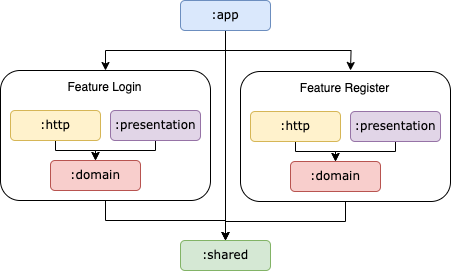

# GoFood Clone Case Study

This is a learning project for Senior Android Developer - TDD Bootcamp from Android Enthusiast Jakarta (AEJ)

## Features
Explanation for each features you can see at this:
* `Register Feature` [specs](./register_feature_specs.md)
* `Login Feature` [specs](./login_feature_specs.md)

## Guide to Modularization

This App contains the following types of modules:
* The `app` module - contains app level, scaffolding classes that bind the rest of the codebase,
  such as `MainActivity`, `factory`, `decorator`, etc. The `app` module depends on `domain` module, `http` module, `presentation` module for each feature and `shared` module.
* The `shared` module - contains common things like model that reusable for all module, utils, theme, frameworks and ui components.
* Each feature contains at least 3 modules, such as `domain`, `http`, `presentation` module.
